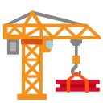

  <h1>Template Collections</h1>

My template collections 🏗️

---

## Rust
- [Rust GraphQL](https://github.com/azzamsa/rust-graphql)
- [Rust CLI](https://github.com/azzamsa/rust-cli)

## Javascript

- [Javascript Svelte](https://github.com/azzamsa/js-svelte)
- [Javascript SvelteKit](https://github.com/azzamsa/js-sveltekit)
